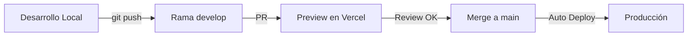

# 🚀 Configuración de GitHub Actions + Vercel

Este documento te guía para configurar el despliegue automático desde GitHub a Vercel.

## 📋 Pre-requisitos

- ✅ Proyecto subido a GitHub
- ✅ Cuenta en Vercel
- ✅ Vercel CLI instalado (`npm i -g vercel`)

## 🔑 Paso 1: Obtener los IDs de Vercel

### Opción A: Desde Vercel CLI (Recomendado)

```bash
# En la carpeta de tu proyecto
vercel link

# Esto creará un archivo .vercel/project.json
# Ábrelo y encontrarás:
# - "orgId": "team_xxxxx" (este es tu VERCEL_ORG_ID)
# - "projectId": "prj_xxxxx" (este es tu VERCEL_PROJECT_ID)
```

### Opción B: Desde el Dashboard de Vercel

1. Ve a tu proyecto en [vercel.com](https://vercel.com)
2. Settings → General
3. Busca "Project ID" (es algo como `prj_xxxxxxxxxxxxx`)
4. Para el Org ID, mira la URL: `https://vercel.com/[ORG_ID]/[project-name]`

## 🔐 Paso 2: Crear Token de Vercel

1. Ve a [vercel.com/account/tokens](https://vercel.com/account/tokens)
2. Click en "Create"
3. Nombre: `github-actions-deployment`
4. Scope: Full Account
5. Expiration: No Expiration (o el tiempo que prefieras)
6. Click "Create Token"
7. **COPIA EL TOKEN** (solo se muestra una vez)

## ⚙️ Paso 3: Configurar Secrets en GitHub

Ve a tu repositorio en GitHub → Settings → Secrets and variables → Actions

Agrega estos 3 secrets:

| Secret Name | Valor | Descripción |
|------------|-------|-------------|
| `VERCEL_TOKEN` | `xxxxxxxxx` | El token que creaste en el paso 2 |
| `VERCEL_ORG_ID` | `team_xxxxx` | Tu Organization/Team ID |
| `VERCEL_PROJECT_ID` | `prj_xxxxx` | Tu Project ID |

### Para agregar cada secret:

1. Click "New repository secret"
2. Name: `VERCEL_TOKEN` (debe ser exacto)
3. Value: Pega el valor correspondiente
4. Click "Add secret"
5. Repite para los otros 2 secrets

## 🔄 Paso 4: Conectar Vercel con GitHub (IMPORTANTE)

```bash
# En la carpeta del proyecto
vercel

# Cuando pregunte:
# - Set up and deploy? Y
# - Which scope? (selecciona tu cuenta)
# - Link to existing project? Y
# - What's the name? handy-sales-crm

# Esto creará .vercel/project.json con los IDs correctos
```

## ✅ Paso 5: Verificar que funciona

1. Haz un pequeño cambio en tu código
2. Commit y push:
```bash
git add .
git commit -m "test: Probar GitHub Actions"
git push
```
3. Ve a GitHub → Actions
4. Deberías ver el workflow ejecutándose

## 📊 Workflows Configurados

### 1. **Deploy Production** (`deploy-production.yml`)
- Se ejecuta cuando haces push a `main`
- Despliega automáticamente a producción
- Comenta la URL en el commit

### 2. **Deploy Preview** (`deploy-preview.yml`)
- Se ejecuta en Pull Requests
- Crea un preview único para cada PR
- Comenta la URL en el PR

### 3. **CI/Tests** (`ci.yml`)
- Se ejecuta en cada push y PR
- Verifica linting, tipos, y build
- Reporta el estado

## 🎯 Flujo de Trabajo Recomendado



## 🆘 Solución de Problemas

### Error: "Resource not accessible by integration"
- Verifica que los Actions tengan permisos de escritura
- Settings → Actions → General → Workflow permissions → Read and write

### Error: "Invalid token"
- Regenera el token en Vercel
- Actualiza el secret `VERCEL_TOKEN` en GitHub

### Error: "Project not found"
- Ejecuta `vercel link` en tu proyecto local
- Verifica que los IDs coincidan

### Build falla en GitHub pero funciona local
- Agrega variables de entorno de build en los secrets de GitHub:
```yaml
env:
  NEXTAUTH_SECRET: ${{ secrets.NEXTAUTH_SECRET }}
  NEXTAUTH_URL: ${{ secrets.NEXTAUTH_URL }}
```

## 📝 Variables de Entorno

Las variables de entorno se manejan en 2 lugares:

1. **En Vercel Dashboard**: Para runtime (producción)
2. **En GitHub Secrets**: Para build time (si son necesarias)

Variables típicas:
```env
# En Vercel Dashboard
NEXTAUTH_URL=https://tu-app.vercel.app
NEXTAUTH_SECRET=xxxxx
NEXT_PUBLIC_API_URL=https://api.tuapp.com

# En GitHub Secrets (además de los de Vercel)
VERCEL_TOKEN=xxxxx
VERCEL_ORG_ID=team_xxxxx
VERCEL_PROJECT_ID=prj_xxxxx
```

## 🎉 ¡Listo!

Ahora cada vez que hagas:
- `git push` a `main` → Deploy automático a producción
- Pull Request → Preview automático con URL única
- Los tests corren automáticamente

## 📚 Comandos Útiles

```bash
# Ver logs de Vercel
vercel logs

# Ver deployments
vercel list

# Promover preview a producción
vercel promote [url]

# Rollback a versión anterior
vercel rollback [url]
```

---

**Última actualización**: Enero 2025
