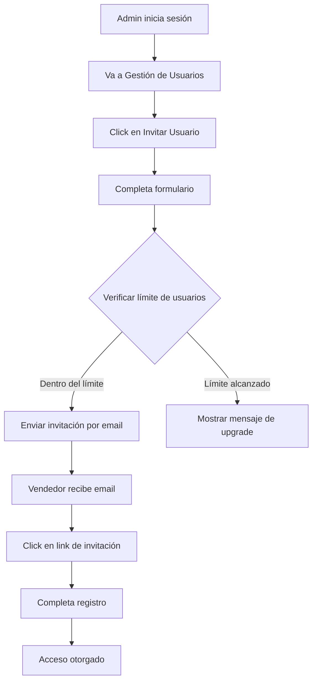

# 🏢 Sistema Multi-Tenant HandySales CRM

## Arquitectura del Sistema

HandySales CRM es un sistema **SaaS B2B multi-tenant** diseñado para distribuidoras y empresas de ventas. Cada organización (tenant) tiene su propio espacio aislado con sus datos, usuarios y configuración.

## 🔐 Modelo de Seguridad

### 1. **Niveles de Acceso**

```
┌─────────────────────────────────────┐
│         SISTEMA COMPLETO            │
│  ┌─────────────────────────────┐   │
│  │     ORGANIZACIÓN (Tenant)    │   │
│  │  ┌────────────────────────┐  │   │
│  │  │       USUARIOS         │  │   │
│  │  │  ┌─────────────────┐   │  │   │
│  │  │  │     ROLES       │   │  │   │
│  │  │  │  ┌──────────┐   │   │  │   │
│  │  │  │  │ PERMISOS │   │   │  │   │
│  │  │  │  └──────────┘   │   │  │   │
│  │  │  └─────────────────┘   │  │   │
│  │  └────────────────────────┘  │   │
│  └─────────────────────────────┘   │
└─────────────────────────────────────┘
```

### 2. **Roles del Sistema**

| Rol | Descripción | Permisos Clave |
|-----|-------------|----------------|
| **OWNER** | Propietario de la organización | Acceso total, gestión de billing |
| **ADMIN** | Administrador | Gestión completa excepto billing |
| **SUPERVISOR** | Supervisor de vendedores | Gestión de rutas y vendedores |
| **VENDEDOR** | Vendedor de campo | Operaciones de venta diarias |

### 3. **Flujo de Alta de Vendedores**



## 💳 Sistema de Membresías

### **Planes Disponibles**

| Plan | Usuarios | Clientes | Productos | Precio MXN | Features |
|------|----------|----------|-----------|------------|----------|
| **Basic** | 3 | 100 | 500 | $399/mes | App móvil, Reportes básicos |
| **Pro** | 10 | 500 | 2000 | $899/mes | + API, Integraciones, Soporte prioritario |
| **Enterprise** | Ilimitado | Ilimitado | Ilimitado | Personalizado | + Multi-sucursal, Personalización, SLA |

### **Estados de Membresía**

- **Trial**: 14 días gratis, todas las features
- **Active**: Membresía pagada y activa
- **Grace Period**: 7 días después de fallo de pago
- **Suspended**: Acceso de solo lectura
- **Cancelled**: Sin acceso, datos archivados por 90 días

## 📱 Sincronización con App Móvil

### **Arquitectura de Sincronización**

```
┌──────────────┐     HTTPS/JWT      ┌──────────────┐
│  App Móvil   │ ◄─────────────────► │   API REST   │
│ React Native │                     │   Next.js    │
└──────────────┘                     └──────────────┘
       │                                     │
       ▼                                     ▼
┌──────────────┐                     ┌──────────────┐
│ SQLite Local │                     │  PostgreSQL  │
│   (Offline)  │                     │   (Cloud)    │
└──────────────┘                     └──────────────┘
```

### **Endpoints de API Móvil**

```typescript
// Autenticación
POST /api/mobile/auth/login
POST /api/mobile/auth/refresh
POST /api/mobile/auth/logout

// Sincronización
GET  /api/mobile/sync/status
POST /api/mobile/sync/pull
POST /api/mobile/sync/push

// Operaciones offline-first
POST /api/mobile/orders/batch
POST /api/mobile/visits/complete
POST /api/mobile/photos/upload
```

### **Proceso de Sincronización**

1. **Login Inicial**
   - App envía credenciales
   - Servidor valida membresía activa
   - Retorna JWT + datos iniciales

2. **Sincronización Delta**
   - App envía timestamp de última sync
   - Servidor envía solo cambios
   - Resolución de conflictos por timestamp

3. **Modo Offline**
   - Datos guardados en SQLite local
   - Queue de cambios pendientes
   - Sync automática al recuperar conexión

## 🔧 Configuración Técnica

### **Variables de Entorno Requeridas**

```env
# Base de datos
DATABASE_URL="postgresql://..."

# Autenticación
NEXTAUTH_SECRET="..."
JWT_SECRET="..."

# Pagos (Stripe/MercadoPago)
STRIPE_SECRET_KEY="..."
STRIPE_WEBHOOK_SECRET="..."

# Email (SendGrid/Resend)
SENDGRID_API_KEY="..."

# Push Notifications
FCM_SERVER_KEY="..."
APNS_KEY="..."

# Storage (S3/Cloudinary)
AWS_S3_BUCKET="..."
CLOUDINARY_URL="..."
```

### **Estructura de Base de Datos**

```sql
-- Tabla de Organizaciones
CREATE TABLE organizations (
  id UUID PRIMARY KEY,
  name VARCHAR(255) NOT NULL,
  slug VARCHAR(100) UNIQUE,
  subscription_plan VARCHAR(50),
  subscription_status VARCHAR(50),
  subscription_end_date TIMESTAMP,
  max_users INTEGER,
  created_at TIMESTAMP DEFAULT NOW()
);

-- Tabla de Usuarios
CREATE TABLE users (
  id UUID PRIMARY KEY,
  organization_id UUID REFERENCES organizations(id),
  email VARCHAR(255) UNIQUE,
  name VARCHAR(255),
  role VARCHAR(50),
  status VARCHAR(50),
  created_at TIMESTAMP DEFAULT NOW()
);

-- Índices para multi-tenancy
CREATE INDEX idx_users_org ON users(organization_id);
CREATE INDEX idx_clients_org ON clients(organization_id);
CREATE INDEX idx_products_org ON products(organization_id);
```

## 🚀 Implementación

### **1. Setup Inicial**

```bash
# Clonar repositorio
git clone https://github.com/tu-org/handysales-crm

# Instalar dependencias
npm install

# Configurar variables de entorno
cp .env.example .env.local

# Ejecutar migraciones
npx prisma migrate dev

# Iniciar desarrollo
npm run dev
```

### **2. Crear Primera Organización**

```typescript
// Script de setup inicial
const createOrganization = async () => {
  const org = await prisma.organization.create({
    data: {
      name: "Mi Distribuidora",
      slug: "mi-distribuidora",
      subscription_plan: "trial",
      subscription_status: "active",
      subscription_end_date: addDays(new Date(), 14),
      max_users: 3,
    }
  });
  
  // Crear usuario admin
  const admin = await prisma.user.create({
    data: {
      organization_id: org.id,
      email: "admin@midistribuidora.com",
      name: "Administrador",
      role: "ADMIN",
      status: "active",
    }
  });
  
  return { org, admin };
};
```

### **3. Invitar Vendedores**

```typescript
// Servicio de invitaciones
const inviteUser = async (
  orgId: string,
  email: string,
  role: string,
  invitedBy: string
) => {
  // Verificar límite
  const org = await getOrganization(orgId);
  const currentUsers = await countUsers(orgId);
  
  if (currentUsers >= org.max_users) {
    throw new Error("Límite de usuarios alcanzado");
  }
  
  // Crear invitación
  const invitation = await createInvitation({
    organization_id: orgId,
    email,
    role,
    invited_by: invitedBy,
    token: generateToken(),
    expires_at: addDays(new Date(), 7),
  });
  
  // Enviar email
  await sendInvitationEmail(email, invitation.token);
  
  return invitation;
};
```

## 📊 Monitoreo y Analytics

### **Métricas Clave**

- **MRR** (Monthly Recurring Revenue)
- **Churn Rate**
- **User Engagement**
- **API Usage**
- **Storage Usage**

### **Dashboards Recomendados**

1. **Admin Dashboard**
   - Usuarios activos
   - Uso de features
   - Límites de plan
   - Próximo billing

2. **Super Admin Dashboard** (HandySales)
   - Total organizaciones
   - MRR por plan
   - Churn analysis
   - Usage patterns

## 🔒 Seguridad

### **Mejores Prácticas**

1. **Aislamiento de Datos**
   - Siempre filtrar por `organization_id`
   - Row Level Security en PostgreSQL
   - Validación en middleware

2. **Autenticación**
   - JWT con expiración corta
   - Refresh tokens seguros
   - 2FA opcional

3. **Rate Limiting**
   - Por organización
   - Por usuario
   - Por endpoint

4. **Auditoría**
   - Log de todas las acciones
   - Retención por 90 días
   - Exportable para compliance

## 📱 App Móvil Companion

### **Stack Técnico**

- **Framework**: React Native / Expo
- **State**: Redux Toolkit + RTK Query
- **Storage**: SQLite + AsyncStorage
- **Auth**: SecureStore
- **Maps**: React Native Maps
- **Camera**: Expo Camera

### **Features Móviles**

- ✅ Modo offline completo
- ✅ GPS tracking de rutas
- ✅ Firma digital de clientes
- ✅ Fotos de evidencia
- ✅ Scanner de códigos de barra
- ✅ Push notifications
- ✅ Sincronización automática
- ✅ Gestión de inventario móvil

## 🎯 Roadmap

### **Q1 2025**
- [ ] Integración con SAT (facturation México)
- [ ] WhatsApp Business API
- [ ] Reportes avanzados con IA

### **Q2 2025**
- [ ] Multi-sucursal
- [ ] Marketplace de integraciones
- [ ] App móvil v2.0

### **Q3 2025**
- [ ] Expansión LATAM
- [ ] API pública v2
- [ ] White-label option

## 📞 Soporte

- **Email**: soporte@handysales.com
- **Docs**: docs.handysales.com
- **API**: api.handysales.com
- **Status**: status.handysales.com
