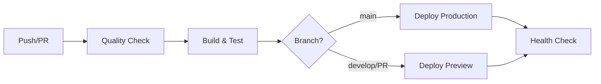

# 🚀 HandyCRM - Guía de Configuración del Pipeline CI/CD

## 📋 Índice
1. [Resumen](#resumen)
2. [Configuración de Secrets en GitHub](#configuración-de-secrets-en-github)
3. [Configuración de Vercel](#configuración-de-vercel)
4. [Uso del Pipeline](#uso-del-pipeline)
5. [Verificación Local](#verificación-local)
6. [Solución de Problemas](#solución-de-problemas)

## Resumen

Este proyecto está configurado con un pipeline CI/CD completo que:
- ✅ Verifica la calidad del código (ESLint, TypeScript)
- ✅ Ejecuta pruebas automatizadas
- ✅ Construye la aplicación
- ✅ Despliega automáticamente a Vercel
- ✅ Realiza verificaciones post-deployment

## 🔐 Configuración de Secrets en GitHub

### Paso 1: Acceder a la configuración
1. Ve a tu repositorio en GitHub
2. Click en **Settings** → **Secrets and variables** → **Actions**
3. Click en **New repository secret**

### Paso 2: Agregar los Secrets de Vercel (OBLIGATORIOS)

#### `VERCEL_TOKEN`
```bash
# Cómo obtenerlo:
1. Ve a https://vercel.com/account/tokens
2. Click en "Create Token"
3. Nombre: "HandyCRM GitHub Actions"
4. Copia el token generado
```

#### `VERCEL_ORG_ID`
```bash
# Cómo obtenerlo:
1. Ve a https://vercel.com/dashboard
2. Click en tu avatar → Settings
3. En "Your ID" copia el ID
```

#### `VERCEL_PROJECT_ID`
```bash
# Cómo obtenerlo:
1. Ve a tu proyecto en Vercel
2. Click en Settings
3. En "Project ID" copia el valor
```

### Paso 3: Secrets de la Aplicación

#### `NEXTAUTH_SECRET`
```bash
# Generar en Windows PowerShell:
[System.Web.Security.Membership]::GeneratePassword(32,8)

# Generar en Linux/Mac/Git Bash:
openssl rand -base64 32

# Generar con Node.js:
node -e "console.log(require('crypto').randomBytes(32).toString('base64'))"
```

#### `NEXTAUTH_URL`
```
Valor: https://handy-sales-crm.vercel.app
```

#### `API_URL`
```
Valor: https://api.tudominio.com (tu API backend)
```

### Paso 4: Secrets de Cloudinary (Opcionales)

Si usas Cloudinary para imágenes:
- `CLOUDINARY_CLOUD_NAME`
- `CLOUDINARY_API_KEY`
- `CLOUDINARY_API_SECRET`

Obténlos desde tu [Dashboard de Cloudinary](https://cloudinary.com/console)

## ⚡ Configuración de Vercel

### En el Dashboard de Vercel:

1. **Variables de Entorno**
   - Ve a tu proyecto → Settings → Environment Variables
   - Agrega las mismas variables que en los secrets de GitHub

2. **Configuración de Git**
   - Ve a Settings → Git
   - Asegúrate de que esté conectado a tu repositorio
   - Desactiva "Auto Deploy" si quieres usar solo GitHub Actions

## 🎯 Uso del Pipeline

### Flujo de Trabajo



### Comandos Locales

```bash
# Verificar configuración antes de deploy
node verify-deployment.js

# Ejecutar linters localmente
npm run lint
npm run type-check

# Build de prueba
npm run build

# Ejecutar tests
npm test
```

### Activar el Pipeline

El pipeline se activa automáticamente cuando:
- ✅ Haces push a `main` → Deploy a producción
- ✅ Haces push a `develop` → Deploy a preview
- ✅ Abres un Pull Request → Deploy a preview + comentario con URL

También puedes activarlo manualmente:
1. Ve a Actions en GitHub
2. Selecciona "HandyCRM CI/CD Pipeline"
3. Click en "Run workflow"

## 🔍 Verificación Local

Antes de hacer push, ejecuta:

```bash
# Script de verificación completo
node verify-deployment.js
```

Este script verifica:
- ✅ Archivos necesarios
- ✅ Configuración de Vercel
- ✅ GitHub Actions
- ✅ Variables de entorno
- ✅ Dependencias
- ✅ Estado de Git
- ✅ Build de prueba (opcional)

## 🛠️ Solución de Problemas

### Error: "VERCEL_TOKEN is not set"
```bash
# Verifica que el secret esté configurado en GitHub
# Settings → Secrets → VERCEL_TOKEN debe existir
```

### Error: "Build failed"
```bash
# Ejecuta localmente:
npm run build

# Si falla, revisa:
1. Errores de TypeScript
2. Imports faltantes
3. Variables de entorno no definidas
```

### Error: "npm ci failed"
```bash
# Limpia y reinstala:
npm run clean:all
npm install --legacy-peer-deps
```

### Preview URL no aparece en PR
```bash
# Verifica que:
1. El workflow esté ejecutándose (pestaña Actions)
2. Los secrets de Vercel estén configurados
3. El bot de GitHub tenga permisos de comentar
```

## 📊 Monitoreo

### En GitHub
- **Actions Tab**: Ver estado de pipelines
- **Pull Requests**: URLs de preview en comentarios
- **Deployments**: Historial de deployments

### En Vercel
- **Dashboard**: Estado de deployments
- **Analytics**: Métricas de rendimiento
- **Functions**: Logs de API routes

## 🔄 Actualizaciones del Pipeline

Para actualizar el pipeline:

1. Edita `.github/workflows/deploy-handy-crm.yml`
2. Commit y push los cambios
3. El pipeline se actualizará automáticamente

## 📝 Notas Importantes

1. **Secrets**: NUNCA commitees secrets en el código
2. **Build**: Siempre prueba el build localmente antes de push
3. **Preview**: Cada PR tendrá su propia URL de preview
4. **Rollback**: Usa el dashboard de Vercel para rollback rápido

## 🆘 Soporte

Si tienes problemas:
1. Revisa los logs en GitHub Actions
2. Verifica la configuración de secrets
3. Ejecuta `node verify-deployment.js`
4. Revisa los logs en Vercel Dashboard

---

## 🎉 ¡Listo para Deploy!

Una vez configurado todo:

```bash
# 1. Verifica la configuración
node verify-deployment.js

# 2. Commit los cambios
git add .
git commit -m "feat: configurar pipeline CI/CD"

# 3. Push para activar el pipeline
git push origin main  # Para producción
# o
git push origin develop  # Para preview
```

El pipeline se ejecutará automáticamente y tu aplicación estará en línea en minutos.

---

Última actualización: Diciembre 2024
