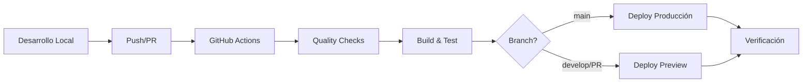

# 🚀 HandyCRM - Customer Relationship Management System

[](https://vercel.com/new/clone?repository-url=https://github.com/yourusername/handy-crm)
[](https://github.com/yourusername/handy-crm/actions)

## 📋 Descripción

HandyCRM es un sistema moderno de gestión de relaciones con clientes (CRM) construido con las últimas tecnologías web.

## 🛠️ Stack Tecnológico

- **Framework**: Next.js 15.4.6
- **UI**: React 19.1.0
- **Estilos**: Tailwind CSS
- **Autenticación**: NextAuth.js
- **Deployment**: Vercel
- **CI/CD**: GitHub Actions
- **Media**: Cloudinary

## 🚀 Inicio Rápido

### Prerequisitos

- Node.js 20.x o superior
- npm o yarn
- Cuenta en Vercel
- Cuenta en GitHub

### Instalación

1. **Clona el repositorio**
   ```bash
   git clone https://github.com/yourusername/handy-crm.git
   cd handy-crm
   ```

2. **Instala las dependencias**
   ```bash
   npm install --legacy-peer-deps
   ```

3. **Configura las variables de entorno**
   ```bash
   cp .env.example .env.local
   # Edita .env.local con tus valores
   ```

4. **Ejecuta en desarrollo**
   ```bash
   npm run dev
   ```

5. **Abre en el navegador**
   ```
   http://localhost:3000
   ```

## 📦 Scripts Disponibles

```bash
# Desarrollo
npm run dev          # Inicia servidor de desarrollo con Turbopack
npm run build        # Construye la aplicación para producción
npm run start        # Inicia servidor de producción

# Calidad de Código
npm run lint         # Ejecuta ESLint
npm run lint:fix     # Corrige problemas de ESLint automáticamente
npm run type-check   # Verifica tipos de TypeScript

# Testing
npm run test         # Ejecuta tests
npm run test:watch   # Ejecuta tests en modo watch
npm run test:coverage # Genera reporte de cobertura

# Deployment
npm run verify       # Verifica configuración antes de deploy
npm run pre-deploy   # Ejecuta todas las verificaciones
npm run deploy:preview # Deploy a preview en Vercel
npm run deploy:prod  # Deploy a producción en Vercel

# Mantenimiento
npm run clean        # Limpia caché de build
npm run clean:all    # Limpia todo (incluyendo node_modules)
npm run fresh        # Reinstala todo desde cero
```

## 🔐 Configuración de Deployment

### Paso 1: Configurar Secrets en GitHub

Ve a **Settings → Secrets → Actions** y agrega:

| Secret | Descripción | Cómo obtenerlo |
|--------|-------------|----------------|
| `VERCEL_TOKEN` | Token de autenticación de Vercel | [Vercel Tokens](https://vercel.com/account/tokens) |
| `VERCEL_ORG_ID` | ID de tu organización en Vercel | Vercel Dashboard → Settings |
| `VERCEL_PROJECT_ID` | ID del proyecto | Proyecto en Vercel → Settings |
| `NEXTAUTH_SECRET` | Secret para NextAuth | `openssl rand -base64 32` |
| `NEXTAUTH_URL` | URL de producción | `https://tu-dominio.vercel.app` |

### Paso 2: Verificar Configuración

```bash
# Ejecuta el script de verificación
npm run verify
```

### Paso 3: Deploy

El pipeline se activa automáticamente al hacer push:

- **Push a `main`** → Deploy a producción
- **Push a `develop`** → Deploy a preview
- **Pull Request** → Deploy a preview + comentario con URL

## 🔄 Flujo de Trabajo



## 📊 Pipeline CI/CD

El pipeline automatizado incluye:

- ✅ **Quality Checks**: ESLint, TypeScript
- ✅ **Testing**: Jest con cobertura
- ✅ **Build**: Construcción optimizada
- ✅ **Deploy**: Automático a Vercel
- ✅ **Health Checks**: Verificación post-deploy
- ✅ **Performance**: Lighthouse CI (en PRs)

## 🐛 Solución de Problemas

### Error en Build
```bash
# Verifica localmente
npm run build

# Limpia y reconstruye
npm run clean:all
npm install --legacy-peer-deps
npm run build
```

### Error en Tests
```bash
# Ejecuta tests localmente
npm run test

# Con cobertura
npm run test:coverage
```

### Error en Deploy
```bash
# Verifica configuración
npm run verify

# Revisa logs en GitHub Actions
```

## 📝 Estructura del Proyecto

```
handy-crm/
├── .github/
│   └── workflows/        # Pipelines CI/CD
├── src/
│   ├── app/             # App Router de Next.js
│   ├── components/      # Componentes React
│   ├── lib/            # Utilidades y configuración
│   └── styles/         # Estilos globales
├── public/             # Archivos estáticos
├── .env.example        # Variables de entorno ejemplo
├── next.config.js      # Configuración de Next.js
├── vercel.json         # Configuración de Vercel
├── package.json        # Dependencias y scripts
└── verify-deployment.js # Script de verificación
```

## 🤝 Contribuir

1. Fork el proyecto
2. Crea tu rama (`git checkout -b feature/AmazingFeature`)
3. Commit tus cambios (`git commit -m 'Add some AmazingFeature'`)
4. Push a la rama (`git push origin feature/AmazingFeature`)
5. Abre un Pull Request

## 📄 Licencia

Este proyecto está bajo licencia privada.

## 🆘 Soporte

Si tienes problemas:

1. Revisa la [documentación del pipeline](./PIPELINE_SETUP.md)
2. Ejecuta `npm run verify` para diagnosticar
3. Revisa los logs en GitHub Actions
4. Abre un issue en GitHub

---

**Última actualización**: Diciembre 2024
**Versión**: 0.1.0
